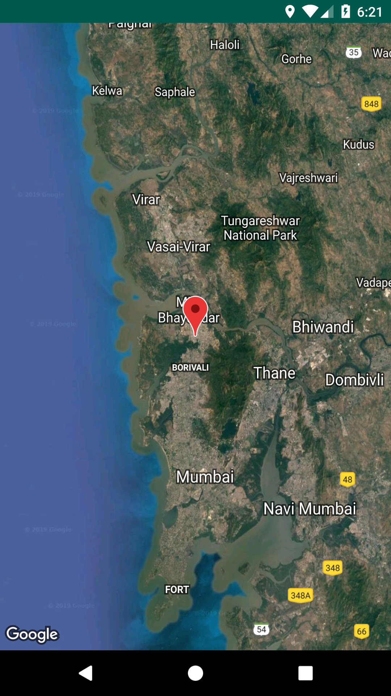

# UserLocation
An android application to show user's current location using Google Map API.

**Third party API used:**
  
  * [Google Map API](https://developers.google.com/maps/documentation/javascript/get-api-key)

**Here is the screenshot:**

